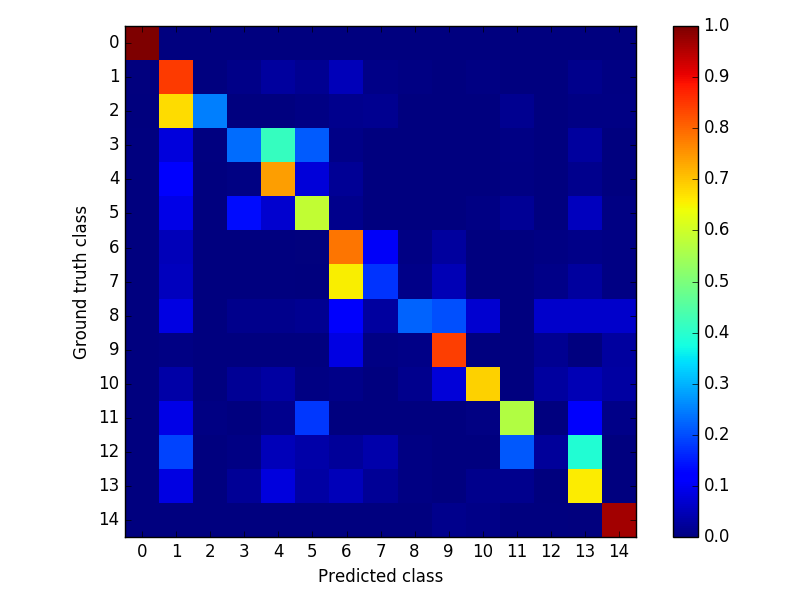
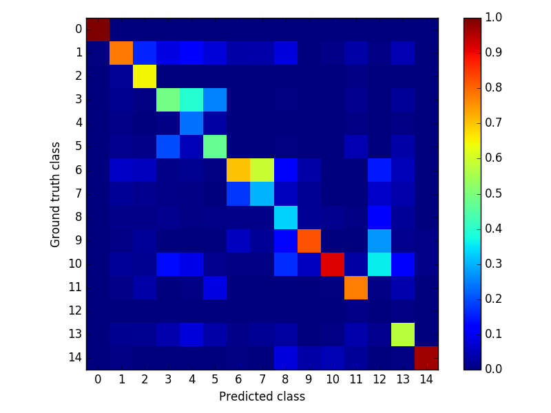

### Testing network
- *experiment* : gdxtracted-rf_seg-prseg_gtflow
- *palette* : None
- *weight* : ../models/gdxtracted-rf_seg-prseg_gtflow/gdxtracted-rf_seg-prseg_gtflow_iter_200000.caffemodel
- *proto* : ../runs/gdxtracted-rf_seg-prseg_gtflow/test.pt
- *config* : ../configs/general.yaml
- *perimg* : ../runs/gdxtracted-rf_seg-prseg_gtflow/perimg.md
- *common* : ../runs/gdxtracted_seg.md
- *exp* : ../experiments/gdxtracted-rf_seg-prseg_gtflow.yaml
- *report* : ../runs/gdxtracted-rf_seg-prseg_gtflow/README.md
- *gpu* : 0
- *out_blobs* : ['out-seg']
- *outdir* : ../output/gdxtracted-rf_seg-prseg_gtflow

global | class | miou
------ | ----- | ----
0.7814 | 0.5728 | 0.4505

- *Confusion matrix* : False Negative | False Positive

 | 
