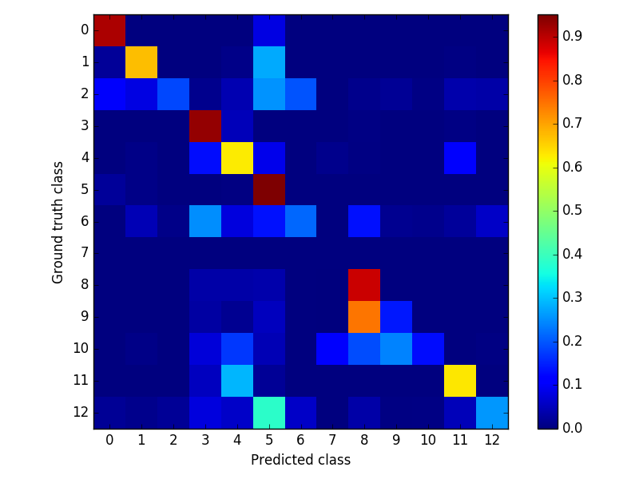
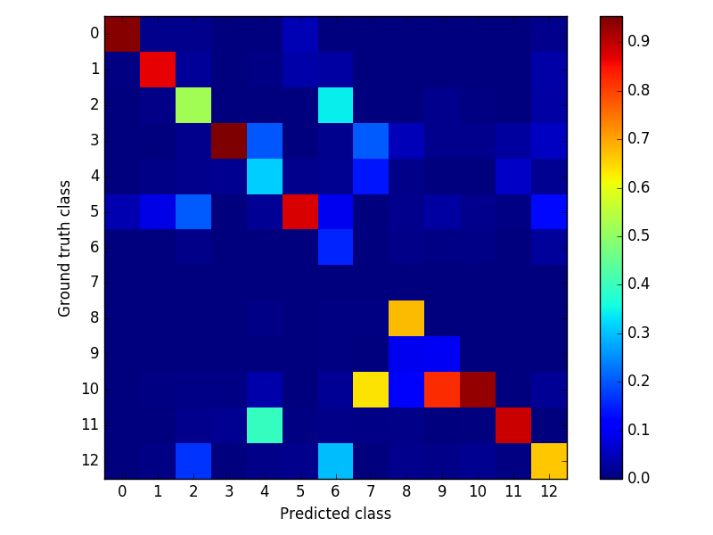

### Testing network
- *experiment* : vkitti-rf_seg-prseg-prflow
- *palette* : None
- *weight* : ../models/vkitti-rf_seg-prseg-prflow/vkitti-rf_seg-prseg-prflow_iter_200000.caffemodel
- *proto* : ../runs/vkitti-rf_seg-prseg-prflow/test.pt
- *config* : ../configs/general.yaml
- *perimg* : ../runs/vkitti-rf_seg-prseg-prflow/perimg.md
- *common* : ../runs/vkitti_seg.md
- *exp* : ../experiments/vkitti-rf_seg-prseg-prflow.yaml
- *report* : ../runs/vkitti-rf_seg-prseg-prflow/README.md
- *gpu* : 0
- *out_blobs* : ['out-seg']
- *outdir* : ../output/vkitti-rf_seg-prseg-prflow

global | class | miou
------ | ----- | ----
0.8538 | 0.5463 | 0.4471

- *Confusion matrix* : False Negative | False Positive

 | 
